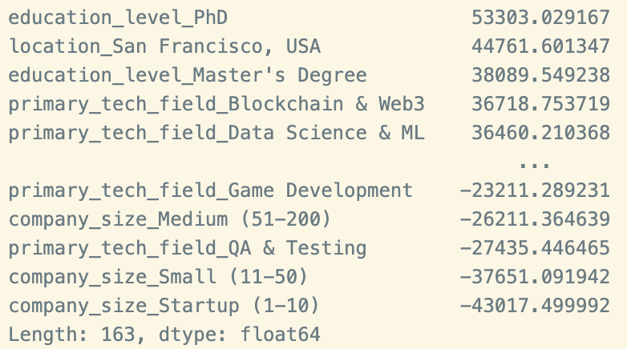
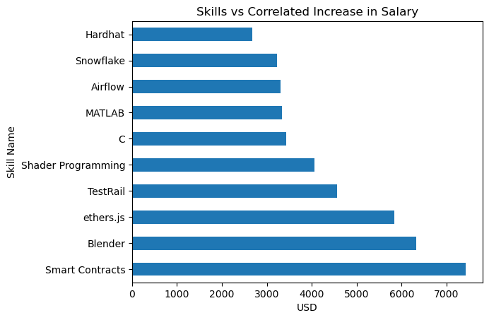
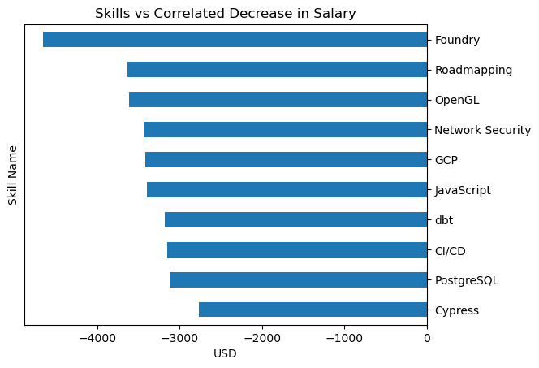
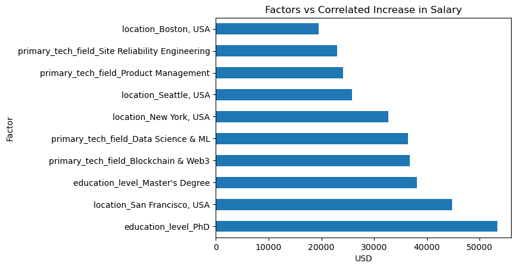
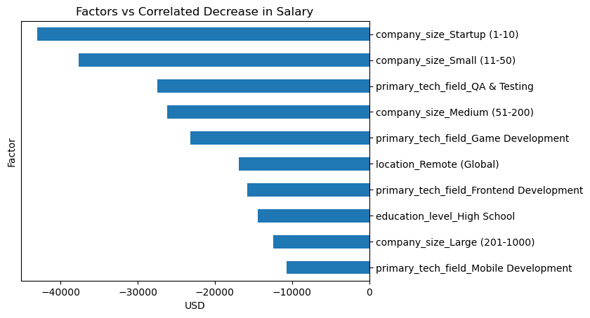

# DDI-Midterm-Project
This repository contains my Supra Coders DDI Midterm Project. In it, I regress factors such as years of experience, field of work, and skills against annual salary.

## Research Question
The question that I aimed to answer in this project was, "Which skills are correlated with the highest increases in salary in the civilian sector?" The answer that I found gives insights into what skills employers find important, and the same goes for the military. I faced this project taking a two-pronged approach for military members- how to best improve skills that the military needs, and what to start thinking about to be marketable if a member is transitioning out of the military. As the country faces  pacing threats and new conflict, there is no better time for military members to be at their best. This goes for anyone, including those who work in tech fields. Thus, my goal was to provide information about how military members can start to improve their skills in order to find the most benefit for their units and themselves. My findings show a framework for how military members should start thinking about their careers, but should absolutely not be taken as sound career advice or recommendation.

## Data
The original DataFrame, or df, was sourced from kaggle, and had 10,000 rows and 50 columns. Each row represents one person and their corresponding values for each column. This was too much data for my project, and some of the columns were correlated with each other. You can see the first 10 rows of my data below.

The first thing I did was filter out jobs that did not pay in US Dollars. I did this using `df = df[df['currency']=='USD']`. I then addressed the number of columns in the df. The original was too large to display in jupyter notebook, so I used `df.columns` to see all the column names. After seeing all of them, I only kept 'skills', 'annual_net_salary_usd', 'experience_years_total', 'location', 'education_level', 'primary_tech_field', and 'company_size'. Going through each of the columns I kept, experience_years_total is the years of experience each person has, and it is a continuous numerical variable. The location column is the location of each person's work, and is a nominal categorical variable. The column education_level is an ordinal categorical variable that describes the highest level of education a person achieved. The primary_tech_field column is a nominal categorical variable that is the tech field that each person works in. The company_size variable describes the size of each person's company that they work for and is an ordinal categorical variable. Skills is a list of each skills each person has and is a nominal categorical value which I converted into a binary dummy variable in later steps. Lastly, the annual_net_salary_usd column is a continuous numerical variable that describes each person's monetary, net salary that they are given as compensation After filtering, I was left with my new `important_columns` df which looked like this.

After filtering all my data, I wanted to address the skills column. It was one long string with each skill a person had separated by a `;` and a space. In order for me to be able to run a regression on this column, I needed to create dummy variables, so I used `skills = important_columns['skills'].str.get_dummies(';')` to create new columns with each of the skill names. I found that there was an exact copy of column names because I forgot to filter the space after each semicolon, so I used `skills.columns = skills.columns.str.strip()` and `skills = skills.groupby(skills.columns, axis=1).max()` to take out the space and group the column names together. Now I had a skills dataframe that looked like this.

This looks scary, but the number of rows matches the number of rows in my filtered df, so if I have to concatenate them, they share an axis with the same size so everything will work out fine. 

Lastly, I had to create dummy variables for each of the columns that had categorical data. I know that the `get_dummies` command is smart and will not convert continuous variables into dummy variables, so I ran `dummy = pd.get_dummies(df_clean[['experience_years_total', 'location', 'education_level', 'primary_tech_field', 'company_size']], drop_first=True, dtype=int)` keeping the years of experience in the new dummy df so that I had all variables that I needed. I then reset both dummy and skills' indices and concatenated them. This was the last step in my data cleaning.

An important note is when creating these dummy variables, I had to remove one category to prevent perfect multicollinearity. This means that each coefficient is the associated pay bump with the removed category as the baseline. For location, the baseline was Austin, education level was associate's degree, primary tech field was backend development, and company size was enterprise(1000+).

## Visualizations

In order to see how each variable affects the annual salary of each person, I ran a linear regression on all the columns against the annual salary. A linear regression is a simple regression model that predicts the dependent variable based on one or more dependent variables. The reason it is called a linear regression is that the resulting line of best fit is a first order equation. I ran my model with the columns that I kept from the last step, and the output can be seen below.

This output is exactly what I wanted, so I split the skill factors and the non skill factors. I graphed the top and bottom 10 skill factors first which can be seen below.

### Graphs

Here, we can see the top 10 skills that are correlated with the highest increases in pay within the df. Smart Contracts, ethers.js, and Hardhat are associated with blockchain and web3 development. Blender and Shader Programming are associated with 3D graphics. TestRail is for testing and quality assurance. C and Matlab are used for technical computing to include analysis and simulations. And Airflow and Snowflake are used for data engineering and infrastructure.

As for the bottom 10, JavaScript, PostgreSQL, and Cypress are used for web and app development. CI/CD and GCP are used for DevOps and cloud infrastructure. OpenGL, Foundry, and dbt are used for graphics, visual computing and data transformation and analytics. Network Security is used in cybersecurity. And Roadmapping is used in strategy and planning.

Seeing these graphs, it looks like the most in demand skills are very specialized, technical skills that not many people know, and the bottom 10 are a little more spread out.

It is important to note that these skills do not _cause_ higher or lower salaries, but are _associated_ with higher salaries in this specific model.

After seeing the results of the skills, I wanted to see how other factors held up when seeing the correlated salary increases or decreases. So, I plotted the top and bottom 10 factors excluding skills which can be seen below.

Knowing which skills and factors yield the highest correlated increases in salary are great. However, my graphs do not capture how common each skill is in the data. Highly specialized skills may lead to much higher pay, as the information surrounding them is esoteric, making the skill not very accessible to most. Therefore, I went through my dataframe and created a metric: how much the skill increases the salary multiplied by the number of times it shows up in the data. With this, I am able to figure out which skills are common and yield the highest correlated pay bumps. The output is shown below.

## Insights

I would  like to preface this part of my README by saying that no information or insights that were produced should be taken as sound career advice or recommendations. These insights are only to be used as deductions based on the data that I processed.

In terms of skills, the obvious choice of skills one might learn according to my findings would be highly specialized tools, or blockchain/web3 development. However, as far as I know, these jobs are assigned  sparingly or are contracted out, as blockchain is not used very heavily in our sector. On the other hand, C and MATLAB, which are used for technical computing, are skills that are widely taught and have free documentation and lessons online. Furthermore, even if these skills are not primarily used in one's role, they can be incorporatedas needed as **force multipliers**.

In the same vein, my common skills table that was shown in the last page shows that some helpful skills to learn can be categorized as application development, infrastructure and DevOps, data analytics, and collaboration and process skills. In my data, these skills were either common, yielded high pay, or both.

## Future Research

In the future, I would like to explore three avenues: incorporating all compensation, testing my model, and using a different model.

1. In the data I found, there were multiple columns relating to salary such as PTO and equity. Fully incorporating all forms of compensation into my model using a "compensation score" may help with the model's clarity and robustness.

2. A way to see how well my model can predict one's annual compensation would be to test my model. This involves splitting the data I feed into the model into training and testing groups. The linear regression would work just the same, using the training rows of data to make coefficients, and then would be tested using the test data to see if the coefficients that were yielded from the training data can predict the test data's annual compensation well.

3. Lastly, I would like to explore using different regression models for my data. Linear regression is a very simple form of modeling data, and has limitations. Other models have different limitations, but also different benefits. In the future, I would like to explore what these other models could tell me about the data and may lead to better prediction.
